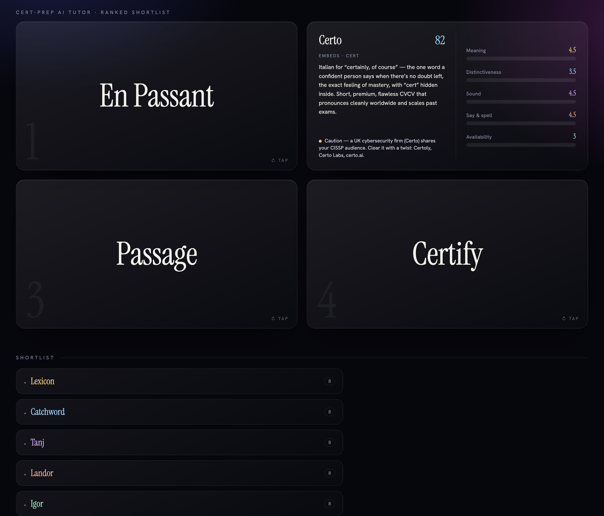

# product-naming — a Claude Code naming skill

Names products, brands, apps, and ventures by orchestrating a **panel of subagents** — modeled on the top US naming firms plus founder & moonshot playbooks — then screening availability and delivering a ranked shortlist with rationale, optionally as an interactive flip-card deck.



## How it works

`SKILL.md` orchestrates the panel through five phases: **brief → generate → evaluate → screen → synthesize.** The orchestrator runs in the main conversation and spawns the subagents in parallel.

### 1. Generators — nine schools brainstorm at once

**Naming firms** — each carries that studio's distilled framework + case studies:

| Studio | Approach | Modeled on |
| --- | --- | --- |
| **Lexicon** | Sound symbolism & invented words | Pentium, Sonos, Swiffer |
| **Catchword** | Vocabulary, volume & storytelling | Asana, Upwork |
| **Tanj** | Strategy-first; map a real word onto the truth | Wii, Ally, Juke |
| **Landor** | Positioning-first; elastic & systemic | FedEx, Enactus |
| **Igor** | Evocative provocations; find the open quadrant | Aria, truTV, WHOOP |

**Founder & portfolio playbooks** — for impact and moonshot ventures:

| Studio | Approach | Modeled on |
| --- | --- | --- |
| **Google X** | Mission-as-name; nature / Earth / myth roots; optimistic, planetary-scale | Waymo, Verily, Wing, Mineral |
| **Musk** | Short, punchy, category-defying; "sounds simple, means something bigger" | Tesla, SpaceX, Neuralink |
| **YC** | Brandable, .com-able, fundable startup names that ship tomorrow | Stripe, Brex, Vanta, Retool |

**Essence** — the on-the-nose baseline (core verbs + feelings), run first so the obvious word is never silently skipped, and used to seed roots for the rest.

### 2. Evaluators — three first-principles lenses score every candidate

- **Phonetics** — does the sound symbolism match the desired feeling?
- **Linguistics** — construction, syllables, spell-ability & say-ability.
- **Psychology** — cognitive fluency, distinctiveness vs. rivals, how it ages.

### 3. Screener

- **Availability** — domain, trademark, and cross-language collision signals.

Candidates get a composite score (with a cross-school agreement bonus and an essence-coverage gate), are screened, and ranked into a final shortlist.

## Structure
```
SKILL.md                                   # the orchestrator skill (source copy)
reference/                                 # deep reference, loaded on demand
  firm-frameworks.md  naming-science.md  scoring-rubric.md
.claude/
  agents/*.md                              # the 13 subagents (9 generators · 3 lenses · 1 screener)
  skills/product-naming/                   # installed (project-scoped) copy
    SKILL.md  reference/  assets/cards-template.html
output/top-names.html                      # example rendered card deck
```

## Install

**Option A — personal (available in every project):**
```bash
mkdir -p ~/.claude/skills/product-naming ~/.claude/agents
cp -R SKILL.md reference .claude/skills/product-naming/assets ~/.claude/skills/product-naming/
cp .claude/agents/*.md ~/.claude/agents/
```

**Option B — project-scoped (checked into one repo):**
```bash
mkdir -p /path/to/project/.claude/skills/product-naming
cp -R SKILL.md reference .claude/skills/product-naming/assets /path/to/project/.claude/skills/product-naming/
cp .claude/agents/*.md /path/to/project/.claude/agents/
```

Then run `/reload-plugins` (or restart Claude Code) so it picks up the new skill and agents.

## Use
Just ask in natural language — the skill auto-triggers on naming requests:
> "Name an AI tutor that helps people pass hard professional certifications."
>
> "Name a low-cost diagnostic that detects malaria from a phone photo."
>
> "Name a swarm of autonomous robots that map and restore coral reefs."

Or invoke explicitly: `/product-naming a fusion reactor startup chasing net-positive energy`

Claude collects a short brief, runs the panel, and returns a ranked shortlist. Say **"quick mode"** to skip the interview, or paste your own list of names to only evaluate/screen them. Ask for a **card deck** to render the top picks as the flip-card visual above (`assets/cards-template.html`) — front shows the name, tap to flip for meaning + score bars, with a studio explorer below.

## Notes
- Availability results are **best-effort screening signals, not legal clearance** — always do a formal trademark search before committing.
- Firm attributions stay visible in the output — you see which school produced each name and why.

## License
[MIT](LICENSE) © 2026 Michael Raspuzzi
